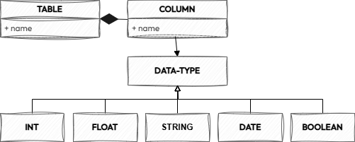

# The Data Joy Specification

## Introduction

The Data Joy Specification (DJS) defines how to describe a tabular data asset using a JSON or YAML document.

### Disclaimer
This is not a real specification. It's just a dummy specification used in this [blog post](#) to showcase how to define an internal specification to describe a data entity of interest. 

## Conventions and Terminology
The keywords "MUST", "MUST NOT", "REQUIRED", "SHALL", "SHALL NOT", "SHOULD", "SHOULD NOT", "RECOMMENDED", "NOT RECOMMENDED", "MAY", and "OPTIONAL" in this document are to be interpreted as described in <a href="https://tools.ietf.org/html/bcp14" target="_blank">BCP 14:octicons-link-external-24:</a>, <a href="https://tools.ietf.org/html/rfc2119" target="_blank">RFC2119:octicons-link-external-24:</a> and <a href="https://tools.ietf.org/html/rfc8174" target="_blank">RFC8174:octicons-link-external-24:</a>, when, and only when, they appear in all capitals, as shown here.

## Versions

The DJS is versioned using <a href="https://semver.org/spec/v2.0.0.html)" target="_blank">Semantic Versioning 2.0.0:octicons-link-external-24:</a> (semver) and follows the semver specification.

The `major`.`minor` portion of the semver (for example `1.0`) SHALL designate the DJS feature set. Typically, *`.patch`* versions address errors in this document, not the feature set. Tooling which supports DJS 1.0 SHOULD be compatible with all DJS 1.0.\* versions. The patch version SHOULD NOT be considered by tooling, making any distinction between `1.0.0` and `1.0.1` for example.

Each new minor version of the DJS SHALL produce annotations that are interpretable by consumers in the same way as in any previous minor version of the Specification, within the same major version. Such an update MUST only require changing the `sas` property to the new minor version.

For example, a valid DJS 1.0.2 DJS, upon changing its `djs` property to `1.1.0`, SHALL be a valid DJS document annotated with SAS 1.1.0, semantically equivalent to the original DJS document. New minor versions of the DJS MUST be written to ensure this form of backward compatibility.

## License
This document is licensed under <a href="https://www.apache.org/licenses/LICENSE-2.0.html" target="_blank">The Apache License, Version 2.0:octicons-link-external-24:</a>.

## Table of Contents
todo

## 🧭 Definitions

### Tabular Data Asset
A Tabular Data Asset is a structured dataset organized into rows and columns, similar to a table in a database or a spreadsheet. Each column represents a specific attribute (feature), while each row corresponds to a unique record (observation). Examples include CSV files, SQL database tables, and Excel sheets.

### Tabular Data Asset Descriptor Document
The document (or set of documents) that contains the definition of a [tabular data asset](#tabular-data-asset) created using and conforming to the [DataJoy Specification](#data-joy-specification).

### Data Joy Specification
The formal description of the rules to follow to create a standard-compliant [Tabular Data Asset Descriptor Document](#tabular-data-asset-descriptor-document).

## 🗺️ Metamodel
A [tabular data asset](#tabular-data-asset) is described using the following metamodel.

A [`Table Object`](table-object) has a `name` and contains a list of `Column Objects`. Each [`Column Object`](column-object) has a unique `name` and a `dataType` that can assume one of the following values: `BOOLEAN`, `INT`, `FLOAT`, `STRING` and `DATE`

## 📜Schema

In the following description, if a field is not explicitly **REQUIRED** or described with a MUST or SHALL, it can be considered OPTIONAL.

### Table Object
This is the root object of each [Tabular Data Asset Descriptor Document](#tabular-data-asset-descriptor-document)

#### Fixed Fields

Field Name | Type | Description
---|:---:|---
djs | `string:version` | **(REQUIRED)** The [semantic version number](https://semver.org/spec/v2.0.0.html) of the [Data Joy Specification Version](#versions) that the [Tabular Data Asset Descriptor Document](#tabular-data-asset-descriptor-document) uses. The [`djs`](#djsSpecVersion) field SHOULD be used by tools to interpret the [Tabular Data Asset Descriptor Document](#tabular-data-asset-descriptor-document). 
name| `string`|**(REQUIRED)** The name of the tabular data asset (es. `customer`)
columns | \[[Column Object](#column-object)\] | **(REQUIRED)** The list of all columns of the tabular data asset.

### Column Object

The `Column Object` describes a data asset's column.

#### Fixed Fields

Field Name | Type | Description
---|:---:|---
name| `string`|**(REQUIRED)** The name of the column (es. `firstName`)
dataType |  `string` | **(REQUIRED)** The logical type of the column. MUST be of the following values: `BOOLEAN`, `INT`, `FLOAT`, `STRING` and `DATE`

## 📚 Annotations Vocabularies
The DJS defines two vocabularies, described in the following sections, to organize the annotations used for adding metadata related to the logical and physical model of the tabular data asset, respectively.

## 📒 Logicla Metadata Annotations Vocabulary

The logical metadata vocabulary contains annotations to provide metadata on the logical model of the data asset.

The current URI for this vocabulary, known as the Physical Metadata Vocabulary, is:  [<https://github.com/andrea-gioia/the-data-joy-spec/blob/main/versions/1.0.0/vocab/meta-physical.json>](https://github.com/andrea-gioia/the-data-joy-spec/blob/main/versions/1.0.0/vocab/meta-physical.json).

<!-- domain -->
####  🔑 domain

- **Domain:** `TABLE`
- **Range:** The value of this keyword MUST be a `string`.
- **Description:** The `domain` keyword specifies the domain to which the data asset belongs.

<!-- primaryKey -->
####  🔑 primaryKey

- **Domain:** `COLUMN`
- **Range:** The value of this keyword MUST be a `boolean`. 
- **Description:** When set to `true`, the `primaryKey` keyword indicates that the property is part of the dataset's primary key.
- **Default:** The default value is `false`.

## 📒 Physical Metadata Annotations Vocabulary

The physical metadata vocabulary contains annotations to provide metadata on the physical model of the data asset.

The current URI for this vocabulary, known as the Physical Metadata Vocabulary, is:  [<https://github.com/andrea-gioia/the-data-joy-spec/blob/main/versions/1.0.0/vocab/meta-physical.json>](https://github.com/andrea-gioia/the-data-joy-spec/blob/main/versions/1.0.0/vocab/meta-physical.json).

<!-- physicalName -->
####  🔑 physicalName

- **Domain:** `TABLE` and `COLUMN`
- **Range:** The value of this keyword MUST be a `string`.  
- **Description:** The name of the element in the source datastore.

<!-- physicalType -->
####  🔑 physicalType

- **Domain:** `TABLE` and `COLUMN`
- **Range:** The value of this keyword MUST be a `string`.  
- **Description:** The type of the element in the source datastore. For [table object](table-object) MAY be equal to `TABLE`, `VIEW`, etc ... For [column object](column-object) MAY be equal to `VARCHAR`, `TINNYINT`, etc...

<!-- partitionKey -->
####  🔑 partitionKey

- **Domain:** `COLUMN`
- **Range:** The value of this keyword MUST be a `boolean`. 
- **Description:** When set to `true`, the `partitionKey` keyword indicates that the property is part of the dataset's partition key.
- **Default:** The default value is `false`.

